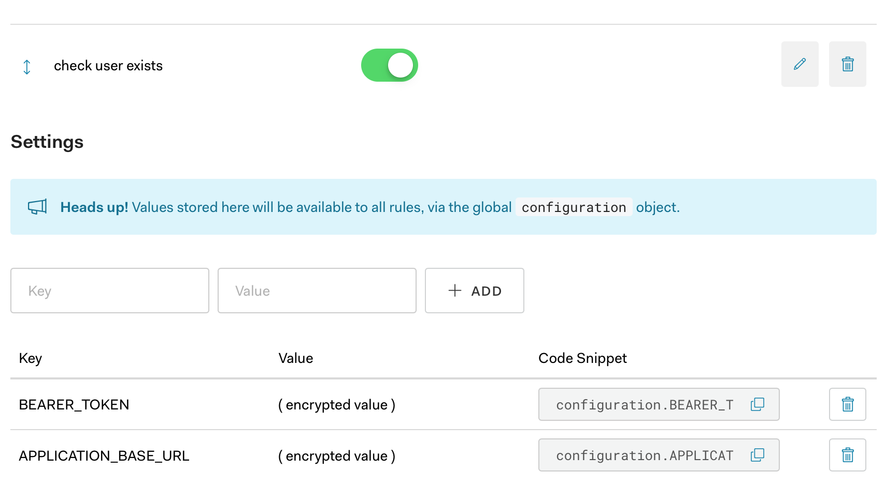

# Back office Auth0 rules

The [rules](rules) directory contains rules (javascript files) for [Auth0](https://auth0.com).  
Auth0 needs 'rules' installed to ensure only certain people can log-in to the back office.

### What is Rule-Based Authentication?

A rule is arbitrary JavaScript code that can be used to extend Auth0's default behavior when authenticating a user. 
Enabled rules will be executed in order for all users and applications as the final step of the authentication process.

### How do I use the rules?

Just create a new `empty rule` in Auth0, use the rule filename as the name of the rule for easy reference, and copy the 
code from the corresponding JS file, without any change. Just copy&paste.

### Rule settings (configuration object)

Rules require some settings to be exposed via the `configuration` object.  
Auth0 already provides this mechanism so only thing to do is make sure the key-values are added to the `Settings` 
section of the rules page.

**Look in the javascript file for a comment block with annotation `:configuration:` to find out what are the 
settings that need to be created.**

For example:

```javascript
// :configuration:
const BEARER_TOKEN = configuration.BEARER_TOKEN;
const APPLICATION_BASE_URL = configuration.APPLICATION_BASE_URL;
// :configuration:
```


